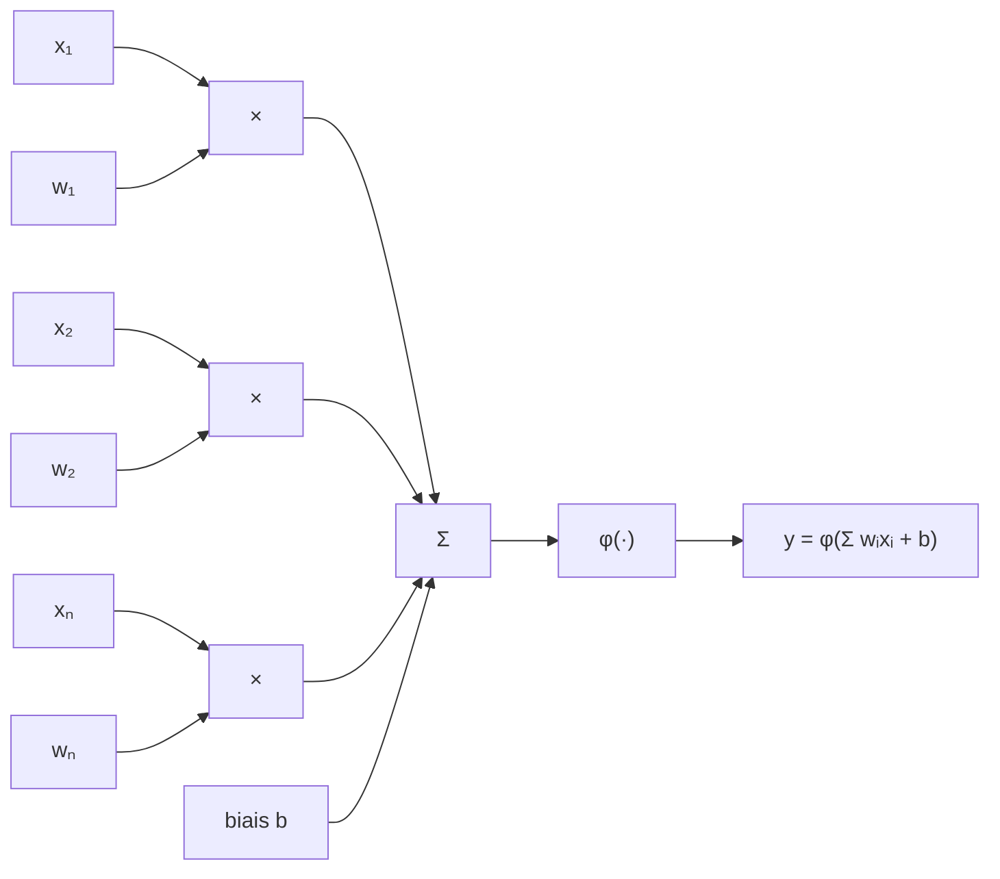
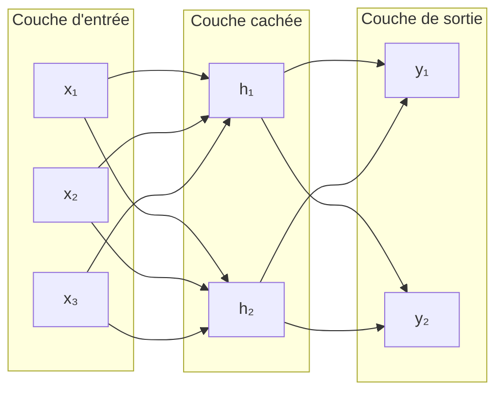

# Comprendre le fonctionnement d'un modèle GPT

L'objectif de ce projet est de comprendre comment fonctionne un modèle de langage GPT. Il existe déjà [microgpt](https://karpathy.github.io/2026/02/12/microgpt/) d'Andrej Karpathy. Ici, l'objectif est d'aller un petit plus loin en ajoutant :

- un tokenizer
- l'utilisation de PyTorch
- la visualisation de l'entraînement avec des graphiques
- l'ajout de quelques techniques influant sur l'entraînement
- la sauvegarde et le chargement d'un modèle pour pouvoir jouer avec sans avoir à le ré-entraîner
- une ligne de commande enrichie pour lancer les différentes expérimentations et apprendre au fur et à mesure

Ce projet retrace mon apprentissage en suivant la même progression.

## Pré-requis

Le projet est écrit en Python et utilise `uv` : la première étape est donc de [l'installer](https://docs.astral.sh/uv/getting-started/installation/). Il faudra ensuite lancer `uv sync`.

## Le voyage commence

Les modèles de langage (LLM) qui alimentent l'IA de nos jours sont l'héritage de longues recherches dans le domaine du Machine Learning (ML) puis du Deep Learning et en parallèle du Natural Language Processing (NLP). Je ne vais pas rentrer dans le détail sur le NLP mais il est essentiel de comprendre le Machine Learning pour aller plus loin.

### Le Machine Learning (ou apprentissage automatique)

> Je voudrais un moyen de connaître les émissions en CO₂ d'un véhicule

Si je devais écrire un programme pour répondre à cette question, il me faudrait connaître la formule permettant de déterminer ce niveau d'émission en fonction de différentes caractéristiques du véhicule.

Je n'ai pas cette formule mais par contre j'ai accès à [un grand nombre de données sur les véhicules commercialisés en France](https://www.data.gouv.fr/datasets/emissions-de-co2-et-de-polluants-des-vehicules-commercialises-en-france) : émissions de CO₂ et différentes caractéristiques du véhicule.

C'est là que le Machine Learning peut m'aider. Le principe de base est le suivant : la "machine" apprend à partir d'un grand nombre d'exemples et généralise pour être en mesure de faire des prédictions sur des données qu'elle n'a jamais vues.

Le cas le plus simple de Machine Learning est la **régression linéaire**.

Nous allons prendre nos données sur les véhicules dans le fichier [data/co2/fic_etiq_edition_40-mars-2015.csv](./data/co2/fic_etiq_edition_40-mars-2015.csv) (téléchargé automatiquement au premier lancement) et nous intéresser à la colonne `co2_mixte` qui représente les émissions en CO₂ en g/km ainsi qu'à la colonne `conso_mixte` qui représente la consommation en L/100km.

La commande `uv run learn-gpt linear data` permet de représenter visuellement les données sous la forme d'un graphique dans le fichier [output/linear/data.png](./output/linear/data.png).

On peut ainsi voir qu'il semble exister une relation linéaire entre les deux informations. Nous allons créer un modèle qui va prédire les émissions en CO₂, notées $\hat{y}$, en fonction de la consommation, notée $x$ :

$$\hat{y} = wx + b$$

Où $w$ est la pente (ou poids) et $b$ l'ordonnée à l'origine (ou biais).

La technique pour trouver les meilleures valeurs de $w$ et $b$ est la **descente de gradient** :

1. On initialise $w$ et $b$ avec des valeurs arbitraires ou aléatoires
2. Pour chaque exemple $x_i$, on calcule la prédiction $\hat{y} = wx_i + b$
3. On calcule la perte, c'est-à-dire l'écart à la prédiction
4. On calcule les dérivées partielles de la perte par rapport à $w$ et $b$
5. On ajuste $w$ et $b$ en utilisant leurs dérivées partielles et un coefficient d'apprentissage
6. On recommence

Il existe plusieurs façons de calculer la perte. Pour notre exemple, on utilise l'erreur quadratique moyenne (MSE, Mean Square Error).

$$L(w, b) = \frac{1}{n} \sum_{i=1}^{n} \left( y_i - \hat{y}_i \right)^2 = \frac{1}{n} \sum_{i=1}^{n} \left( y_i - (w x_i + b) \right)^2$$

[Détail du calcul des dérivées partielles](./docs/derivees_partielles.md)

La commande `uv run learn-gpt linear train` permet de lancer l'entraînement du modèle, de visualiser le résultat dans [output/linear/regression.png](./output/linear/regression.png) et la courbe d'apprentissage dans [output/linear/learn.png](./output/linear/learn.png).

Le code associé est dans [src/learn_gpt/linear/train.py](./src/learn_gpt/linear/train.py). Il utilise les tenseurs de PyTorch : une petite introduction est présente dans [docs/tensor.md](./docs/tensor.md).

Il existe d'autres modèles d'apprentissage (voir [Apprentissage automatique](https://fr.wikipedia.org/wiki/Apprentissage_automatique#Modèles)), mais ils reposent tous sur le même principe : appliquer des opérations à une entrée, mesurer la perte, puis ajuster les paramètres pour la réduire. Les modèles GPT ne font pas exception, ils se contentent d'enchaîner beaucoup plus d'opérations sur beaucoup plus de paramètres.

## Le Deep Learning (ou apprentissage profond)

### Introduction

L'[apprentissage profond](https://fr.wikipedia.org/wiki/Apprentissage_profond) est une technique d'apprentissage automatique qui utilise des réseaux de neurones artificiels. Un neurone artificiel (ou formel) n'est ni plus ni moins qu'une fonction mathématique. Il se schématise comme suit :



Sa formule mathématique est :

$$y = \varphi (\sum_{i=1}^{n}w_i x_i + b)$$

où :

- $x_i$ sont les entrées,
- $w_i$ sont les poids,
- $b$ est le biais,
- $\varphi$ est la fonction d'activation,
- $y$ est la sortie du neurone.

On y retrouve l'équation de la régression linéaire mais avec plusieurs entrées et une fonction d'activation. La fonction d'activation est généralement une fonction non linéaire : elle permet de "plier" la sortie et de la borner.

Ces neurones sont ensuite agencés en un réseau, par exemple :



Ce réseau prend en entrée 3 valeurs ($x_1$, $x_2$, $x_3$), utilise 2 neurones cachés ($h_1$, $h_2$) et 2 neurones de sortie ($y_1$, $y_2$). Les neurones cachés ont chacun 3 poids et 1 biais, tandis que les neurones de sortie ont chacun 2 poids et 1 biais. Ce réseau a donc 14 paramètres.

Pour entraîner ce réseau à prédire $(y_1, y_2)$ en fonction de $(x_1, x_2, x_3)$ la technique est sensiblement la même que sur la régression linéaire :

- les valeurs de sortie sont calculées pour un ensemble de données d'entrée
- la perte par rapport à la sortie attendue est calculée
- les dérivées partielles de la perte pour chaque paramètre sont calculées
- chaque paramètre est ajusté
- on recommence

Une simple implémentation de neurone est visible dans [src/learn_gpt/neuron/neuron.py](./src/learn_gpt/neuron/neuron.py) et la commande `uv run learn-gpt neuron show` permet de visualiser la sortie d'un neurone avec différentes valeurs de $w$ et $b$ dans [output/neuron/neuron.png](./output/neuron/neuron.png).

Ce fichier contient également une implémentation d'un petit réseau de neurones 1 → h → 1 (1 entrée, h neurones cachés, 1 sortie) qu'il est possible d'entraîner à coller à la parabole x² avec la commande `uv run learn-gpt neuron parabola`. Il est possible de jouer sur le taux d'apprentissage et le nombre d'époques (i.e. le nombre de fois où l'on fait passer la totalité des données au modèle) : `uv run learn-gpt neuron parabola --lr=0.05 --epochs=1000`. La courbe d'apprentissage sera consultable dans [output/neuron/learn_simple.png](./output/neuron/learn_simple.png) et le résultat dans [output/neuron/parabola.png](./output/neuron/parabola.png).

### Entraînement d'un réseau de neurones

Dans notre régression linéaire sur les émissions de CO₂, nous avions utilisé en entrée les données de consommation (en L/100 km) ce qui est un peu de la triche car la consommation est déjà une donnée embarquant un grand nombre de phénomènes physiques et chimiques. Il n'est donc pas étonnant de trouver une relation linéaire entre cette consommation et les émissions de CO₂.

Nous allons donc ignorer cette consommation et nous baser sur 4 autres données :

- la puissance maximum du véhicule
- sa puissance administrative déclarée
- sa masse
- son carburant (essence ou diesel)

Nous allons donc utiliser un réseau 4 → h → 1. Nous pourrions même imaginer avoir plusieurs couches : 4 → h → h → h → 1. Ce type de réseau est appelé réseau MLP pour [Multilayer Perceptron](https://fr.wikipedia.org/wiki/Perceptron_multicouche).

Nous allons également diviser aléatoirement notre jeu de données en deux : des données d'entraînement et des données de validation. Le modèle n'est pas entraîné sur les données de validation et donc un calcul de perte sur ces données est une mesure plus honnête de la performance du modèle.

L'entraînement de notre modèle sur les données de CO₂ peut être lancé avec `uv run learn-gpt neuron co2` et la courbe d'apprentissage résultant sera disponible dans [output/neuron/co2_learn.png](./output/neuron/co2_learn.png).

Les hyperparamètres sont les paramètres qui permettent de régler le modèle et son entraînement, et de s'assurer que le modèle apprend correctement. Nous avons déjà vu le taux d'apprentissage (LR, Learning Rate) et le nombre d'époques. Sur ce modèle, il est possible de régler :

- la taille des couches cachées : le nombre de neurones dans chaque couche cachée. C'est le premier levier pour augmenter la capacité du modèle
- le nombre de couches cachées : empiler plusieurs couches permet au réseau de représenter des relations plus complexes entre les entrées
- la taille de lots : en effet, ici l'entraînement est fait par lots piochés dans la totalité des données
- le [weight decay](https://fr.wikipedia.org/wiki/Weight_decay) : il s'agit d'appliquer une pénalité qui dépend des poids à la perte et qui limite le [surapprentissage](https://fr.wikipedia.org/wiki/Surapprentissage) (le modèle est trop adapté à ses données d'entraînement et incapable de généraliser : cette problématique peut s'observer sur les courbes d'apprentissage lorsque la courbe sur les données stagne ou monte alors que la courbe sur les données d'entraînement continue de descendre)
- le [dropout](https://fr.wikipedia.org/wiki/Abandon_(réseaux_neuronaux)) : une autre technique pour limiter le surapprentissage qui consiste à "éteindre" aléatoirement certains neurones durant l'entraînement
- la technique de descente de gradient pour utiliser [Adam](https://fr.wikipedia.org/wiki/Algorithme_du_gradient_stochastique#Adam) plutôt qu'une descente de gradient classique : cette technique applique un taux d'apprentissage adaptatif

`uv run learn-gpt neuron co2 --help` pour voir comment influer sur ces hyperparamètres.

## Prédire du texte

### Représenter le texte sous forme de nombres

Nous allons commencer par essayer de générer des noms d'animaux en entraînant un modèle sur une liste de noms d'animaux. Dans un premier temps, nous allons créer un modèle qui prédit le caractère suivant en fonction des caractères précédents.

Les réseaux de neurones ne travaillant que sur des nombres, il nous faut un moyen de transformer du texte en nombres. Pour cela, nous allons d'abord utiliser un **tokenizer** qui va transformer chaque caractère en un entier qui représente l'identifiant du **token**. Le nombre de tokens que connaît un tokenizer est sa taille de vocabulaire (`vocab_size`).

```
'chat' -> [5, 9, 3, 17]
```

Chaque token est une **classe** au sens de l'apprentissage automatique. Contrairement à notre exemple sur les émissions de CO₂, notre modèle ne va pas prédire une valeur mais va calculer, parmi un ensemble de classes, la probabilité de chaque classe.

Nous allons ensuite associer à chaque token un vecteur de nombre, l'**[embedding](https://fr.wikipedia.org/wiki/Word_embedding)**, via une matrice d'embedding de taille `(vocab_size, embedding_dim)` où `embedding_dim` est la taille souhaitée des vecteurs représentant les tokens. Par exemple, pour une taille d'embedding de 4, on pourrait avoir :

```
'c' -> 5 -> [ 0.5988, -1.5551, -0.3414,  1.8530]
```

Cette matrice d'embedding est composée de `vocab_size x embedding_dim` poids qui seront ajustés pendant l'entraînement : elle apprend la bonne représentation des caractères pour permettre au réseau de faire son travail de prédiction. Deux caractères proches du point de vue de la prédiction (c'est-à-dire qui arrivent souvent après le même enchaînement de caractères) auront des vecteurs proches.

Pour visualiser ces opérations de traitement des mots : `uv run learn-gpt text show`.

### Calculer la perte

Le modèle que nous allons construire produit en sortie `vocab_size` **logits** : un score pour chaque classe (i.e. chaque token du vocabulaire). Sur un exemple simplifié à 3 classes :

```
logits: [1.0, 3.0, 0.5] → la classe la plus probable est la 2ème
```

Ces logits sont transformés en une distribution de probabilités avec la fonction [softmax](https://fr.wikipedia.org/wiki/Fonction_softmax) :

$$\sigma(z)_j = \frac {e^{z_j}} {\sum_{k=1}^{K}e^{z_k}} \text{pour tout }j \in \{1,...,K\}$$

Pour chaque logit sa probabilité est donc son exponentielle divisée par la somme des exponentielles de tous les logits. Ces probabilités sont comprises entre 0 et 1 et leur somme vaut 1.

On calcule la perte en faisant $-log(p)$ où $p$ est la probabilité attribuée par le modèle à la classe attendue : si cette probabilité est élevée (le modèle avait bien vu), la perte est faible. Si la probabilité de la classe attendue est faible, la perte explose. C'est ce qu'on appelle l'[entropie croisée](https://fr.wikipedia.org/wiki/Entropie_croisée).

Pour visualiser ces calculs de perte : `uv run learn-gpt text loss`.

### v1 : prédire le prochain caractère

Avec ces éléments, nous pouvons construire un premier modèle pour prédire le caractère suivant. Ce premier modèle n'aura qu'un seul caractère de contexte.

Pour entraîner ce modèle, nous allons construire pour chaque mot les paires **(caractère, caractère suivant)** puis nous donnerons au modèle les **caractères** et calculerons la perte par rapport aux **caractères suivants**.

Le modèle et le code d'entraînement sont dans [src/learn_gpt/text/models.py](./src/learn_gpt/text/models.py). La commande pour lancer l'entraînement et visualiser quelques prédictions est `uv run learn-gpt text v1`. La courbe d'apprentissage sera visible dans [output/text/v1_learn.png](./output/text/v1_learn.png). `uv run learn-gpt text v1 --help` pour voir les paramètres sur lesquels il est possible d'influer.
