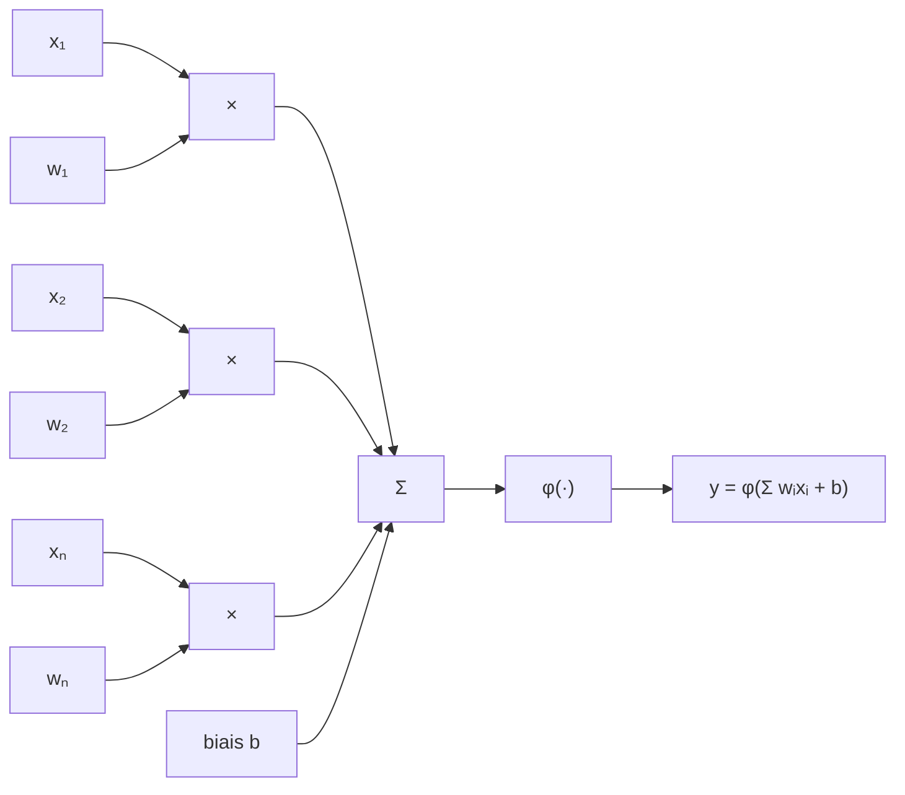
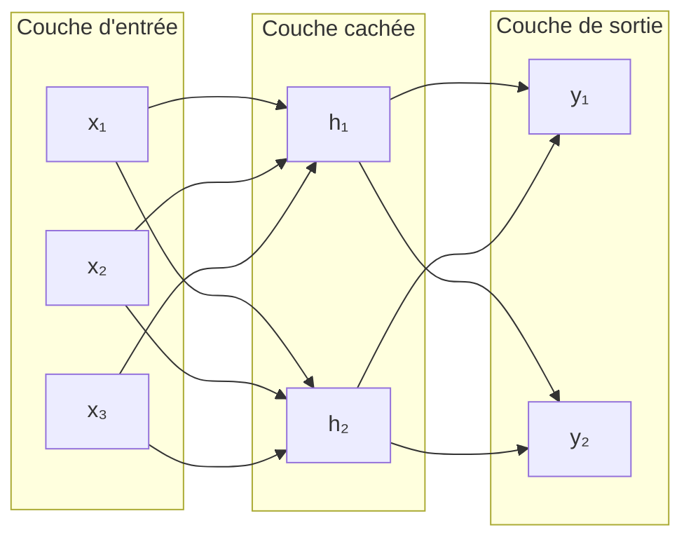

# Comprendre le fonctionnement d'un modèle GPT

L'objectif de ce projet est de comprendre comment fonctionne un modèle de langage GPT. Il existe déjà [microgpt](https://karpathy.github.io/2026/02/12/microgpt/) d'Andrej Karpathy. Ici, l'objectif est d'aller un petit plus loin en ajoutant :

- un tokenizer
- l'utilisation de PyTorch
- la visualisation de l'entraînement avec des graphiques
- l'ajout de quelques techniques influant sur l'entraînement
- la sauvegarde et le chargement d'un modèle pour pouvoir jouer avec sans avoir à le ré-entraîner
- une ligne de commande enrichie pour lancer les différentes expérimentations et apprendre au fur et à mesure

Ce projet retrace mon apprentissage en suivant la même progression.

## Pré-requis

Le projet est écrit en Python et utilise `uv` : la première étape est donc de [l'installer](https://docs.astral.sh/uv/getting-started/installation/). Il faudra ensuite lancer `uv sync`.

## Le voyage commence

Les modèles de langage (LLM) qui alimentent l'IA de nos jours sont l'héritage de longues recherches dans le domaine du Machine Learning (ML) puis du Deep Learning et en parallèle du Natural Language Processing (NLP). Je ne vais pas rentrer dans le détail sur le NLP mais il est essentiel de comprendre le Machine Learning pour aller plus loin.

### Le Machine Learning (ou apprentissage automatique)

> Je voudrais un moyen de connaître les émissions en CO₂ d'un véhicule

Si je devais écrire un programme pour répondre à cette question, il me faudrait connaître la formule permettant de déterminer ce niveau d'émission en fonction de différentes caractéristiques du véhicule.

Je n'ai pas cette formule mais par contre j'ai accès à [un grand nombre de données sur les véhicules commercialisés en France](https://www.data.gouv.fr/datasets/emissions-de-co2-et-de-polluants-des-vehicules-commercialises-en-france) : émissions de CO₂ et différentes caractéristiques du véhicule.

C'est là que le Machine Learning peut m'aider. Le principe de base est le suivant : la "machine" apprend à partir d'un grand nombre d'exemples et généralise pour être en mesure de faire des prédictions sur des données qu'elle n'a jamais vues.

Le cas le plus simple de Machine Learning est la **régression linéaire**.

Nous allons prendre nos données sur les véhicules dans le fichier [data/co2/fic_etiq_edition_40-mars-2015.csv](./data/co2/fic_etiq_edition_40-mars-2015.csv) (téléchargé automatiquement au premier lancement) et nous intéresser à la colonne `co2_mixte` qui représente les émissions en CO₂ en g/km ainsi qu'à la colonne `conso_mixte` qui représente la consommation en L/100km.

La commande `uv run learn-gpt linear data` permet de représenter visuellement les données sous la forme d'un graphique dans le fichier [output/linear/data.png](./output/linear/data.png).

On peut ainsi voir qu'il semble exister une relation linéaire entre les deux informations. Nous allons créer un modèle qui va prédire les émissions en CO₂, notées $\hat{y}$, en fonction de la consommation, notée $x$ :

$$\hat{y} = wx + b$$

Où $w$ est la pente (ou poids) et $b$ l'ordonnée à l'origine (ou biais).

La technique pour trouver les meilleures valeurs de $w$ et $b$ est la **descente de gradient** :

1. On initialise $w$ et $b$ avec des valeurs arbitraires ou aléatoires
2. Pour chaque exemple $x_i$, on calcule la prédiction $\hat{y} = wx_i + b$
3. On calcule la perte, c'est-à-dire l'écart à la prédiction
4. On calcule les dérivées partielles de la perte par rapport à $w$ et $b$
5. On ajuste $w$ et $b$ en utilisant leurs dérivées partielles et un coefficient d'apprentissage
6. On recommence

Il existe plusieurs façons de calculer la perte. Pour notre exemple, on utilise l'erreur quadratique moyenne (MSE, Mean Square Error).

$$L(w, b) = \frac{1}{n} \sum_{i=1}^{n} \left( y_i - \hat{y}_i \right)^2 = \frac{1}{n} \sum_{i=1}^{n} \left( y_i - (w x_i + b) \right)^2$$

[Détail du calcul des dérivées partielles](./docs/derivees_partielles.md)

La commande `uv run learn-gpt linear train` permet de lancer l'entraînement du modèle, de visualiser le résultat dans [output/linear/regression.png](./output/linear/regression.png) et la courbe d'apprentissage dans [output/linear/learn.png](./output/linear/learn.png).

Le code associé est dans [src/learn_gpt/linear/train.py](./src/learn_gpt/linear/train.py). Il utilise les tenseurs de PyTorch : une petite introduction est présente dans [docs/tensor.md](./docs/tensor.md).

Il existe d'autres modèles d'apprentissage (voir [Apprentissage automatique](https://fr.wikipedia.org/wiki/Apprentissage_automatique#Modèles)), mais ils reposent tous sur le même principe : appliquer des opérations à une entrée, mesurer la perte, puis ajuster les paramètres pour la réduire. Les modèles GPT ne font pas exception, ils se contentent d'enchaîner beaucoup plus d'opérations sur beaucoup plus de paramètres.

## Le Deep Learning (ou apprentissage profond)

L'[apprentissage profond](https://fr.wikipedia.org/wiki/Apprentissage_profond) est une technique d'apprentissage automatique qui utilise des réseaux de neurones artificiels. Un neurone artificiel (ou formel) n'est ni plus ni moins qu'une fonction mathématique. Il se schématise comme suit :

Sa formule mathématique est :

$$y = \varphi (\sum_{i=1}^{n}w_i x_i + b)$$

où :

- $x_i$ sont les entrées,
- $w_i$ sont les poids,
- $b$ est le biais,
- $\varphi$ est la fonction d'activation,
- $y$ est la sortie du neurone.

On y retrouve l'équation de la régression linéaire mais avec plusieurs entrées et une fonction d'activation. La fonction d'activation est généralement une fonction non linéaire : elle permet de "plier" la sortie et de la borner.

Ces neurones sont ensuite agencés en un réseau, par exemple :

Ce réseau prend en entrée 3 valeurs ($x_1$, $x_2$, $x_3$), utilise 2 neurones cachés ($h_1$, $h_2$) et 2 neurones de sortie ($y_1$, $y_2$). Les neurones cachés ont chacun 3 poids et 1 biais, tandis que les neurones de sortie ont chacun 2 poids et 1 biais. Ce réseau a donc 14 paramètres.

Pour entraîner ce réseau à prédire $(y_1, y_2)$ en fonction de $(x_1, x_2, x_3)$ la technique est sensiblement la même que sur la régression linéaire :

- les valeurs de sortie sont calculées pour un ensemble de données d'entrée
- la perte par rapport à la sortie attendue est calculée
- les dérivées partielles de la perte pour chaque paramètre sont calculées
- chaque paramètre est ajusté
- on recommence

Une simple implémentation de neurone est visible dans [src/learn_gpt/neuron/neuron.py](./src/learn_gpt/neuron/neuron.py) et la commande `uv run learn-gpt neuron show` permet de visualiser la sortie d'un neurone avec différentes valeurs de $w$ et $b$ dans [output/neuron/neuron.png](./output/neuron/neuron.png).

De fichier contient également une implémentation d'un petit réseau de neurones 1 → h → 1 (1 entrée, h neurones cachés, 1 sortie) qu'il est possible d'entraîner à coller à la parabole x² avec la commande `uv run learn-gpt neuron parabola`. Il est possible de jouer sur le taux d'apprentissage et le nombre d'époques : `uv run learn-gpt neuron parabola --lr=0.05 --epochs=1000`. La courbe d'apprentissage sera consultable dans [output/neuron/learn_simple.png](./output/neuron/learn_simple.png) et le résultat dans [output/neuron/parabola.png](./output/neuron/parabola.png).
