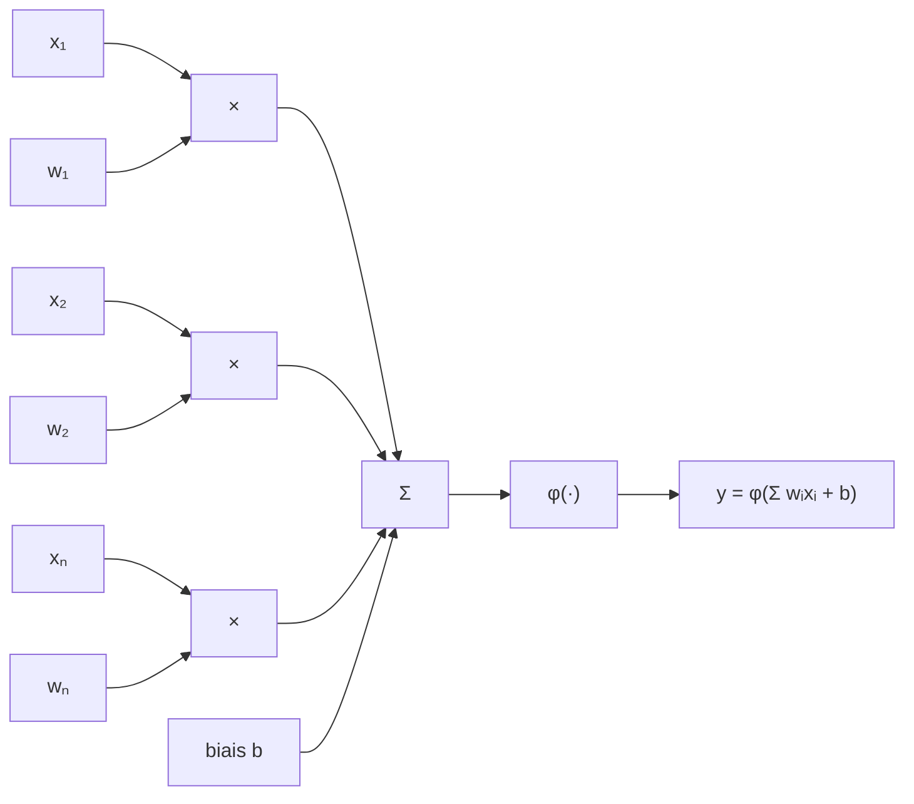
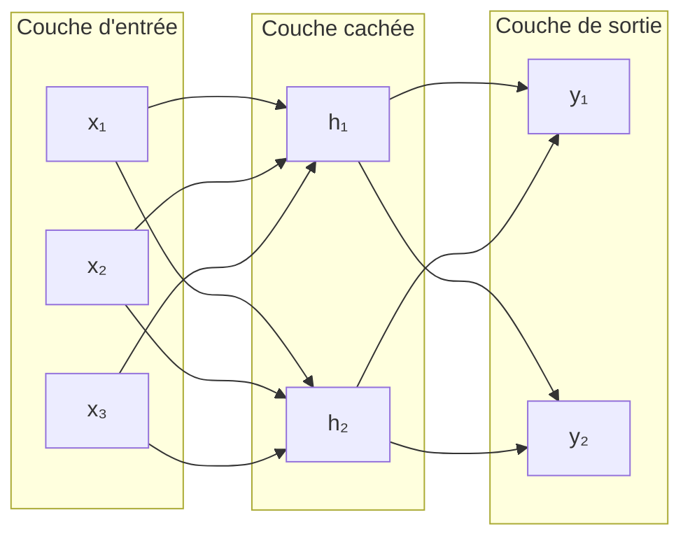

# Comprendre le fonctionnement d'un modèle GPT

L'objectif de ce projet est de comprendre comment fonctionne un modèle de langage GPT. Il existe déjà [microgpt](https://karpathy.github.io/2026/02/12/microgpt/) d'Andrej Karpathy. Ici, l'objectif est d'aller un petit plus loin en ajoutant :

- un tokenizer
- l'utilisation de PyTorch
- la visualisation de l'entraînement avec des graphiques
- l'ajout de quelques techniques influant sur l'entraînement
- la sauvegarde et le chargement d'un modèle pour pouvoir jouer avec sans avoir à le ré-entraîner
- une ligne de commande enrichie pour lancer les différentes expérimentations et apprendre au fur et à mesure

Ce projet retrace mon apprentissage en suivant la même progression.

## Pré-requis

Le projet est écrit en Python et utilise `uv` : la première étape est donc de [l'installer](https://docs.astral.sh/uv/getting-started/installation/). Il faudra ensuite lancer `uv sync`.

## Le voyage commence

Les modèles de langage (LLM) qui alimentent l'IA de nos jours sont l'héritage de longues recherches dans le domaine du Machine Learning (ML) puis du Deep Learning et en parallèle du Natural Language Processing (NLP). Je ne vais pas rentrer dans le détail sur le NLP mais il est essentiel de comprendre le Machine Learning pour aller plus loin.

### Le Machine Learning (ou apprentissage automatique)

> Je voudrais un moyen de connaître les émissions en CO₂ d'un véhicule

Si je devais écrire un programme pour répondre à cette question, il me faudrait connaître la formule permettant de déterminer ce niveau d'émission en fonction de différentes caractéristiques du véhicule.

Je n'ai pas cette formule mais par contre j'ai accès à [un grand nombre de données sur les véhicules commercialisés en France](https://www.data.gouv.fr/datasets/emissions-de-co2-et-de-polluants-des-vehicules-commercialises-en-france) : émissions de CO₂ et différentes caractéristiques du véhicule.

C'est là que le Machine Learning peut m'aider. Le principe de base est le suivant : la "machine" apprend à partir d'un grand nombre d'exemples et généralise pour être en mesure de faire des prédictions sur des données qu'elle n'a jamais vues.

Le cas le plus simple de Machine Learning est la **régression linéaire**.

Nous allons prendre nos données sur les véhicules dans le fichier [data/co2/fic_etiq_edition_40-mars-2015.csv](./data/co2/fic_etiq_edition_40-mars-2015.csv) (téléchargé automatiquement au premier lancement) et nous intéresser à la colonne `co2_mixte` qui représente les émissions en CO₂ en g/km ainsi qu'à la colonne `conso_mixte` qui représente la consommation en L/100km.

La commande `uv run learn-gpt linear data` permet de représenter visuellement les données sous la forme d'un graphique dans le fichier [output/linear/data.png](./output/linear/data.png).

On peut ainsi voir qu'il semble exister une relation linéaire entre les deux informations. Nous allons créer un modèle qui va prédire les émissions en CO₂, notées $\hat{y}$, en fonction de la consommation, notée $x$ :

$$\hat{y} = wx + b$$

Où $w$ est la pente (ou poids) et $b$ l'ordonnée à l'origine (ou biais).

La technique pour trouver les meilleures valeurs de $w$ et $b$ est la **descente de gradient** :

1. On initialise $w$ et $b$ avec des valeurs arbitraires ou aléatoires
2. Pour chaque exemple $x_i$, on calcule la prédiction $\hat{y} = wx_i + b$
3. On calcule la perte, c'est-à-dire l'écart à la prédiction
4. On calcule les dérivées partielles de la perte par rapport à $w$ et $b$
5. On ajuste $w$ et $b$ en utilisant leurs dérivées partielles et un coefficient d'apprentissage
6. On recommence

Il existe plusieurs façons de calculer la perte. Pour notre exemple, on utilise l'erreur quadratique moyenne (MSE, Mean Square Error).

$$L(w, b) = \frac{1}{n} \sum_{i=1}^{n} \left( y_i - \hat{y}_i \right)^2 = \frac{1}{n} \sum_{i=1}^{n} \left( y_i - (w x_i + b) \right)^2$$

[Détail du calcul des dérivées partielles](./docs/derivees_partielles.md)

La commande `uv run learn-gpt linear train` permet de lancer l'entraînement du modèle, de visualiser le résultat dans [output/linear/regression.png](./output/linear/regression.png) et la courbe d'apprentissage dans [output/linear/learn.png](./output/linear/learn.png).

Le code associé est dans [src/learn_gpt/linear/train.py](./src/learn_gpt/linear/train.py). Il utilise les tenseurs de PyTorch : une petite introduction est présente dans [docs/tensor.md](./docs/tensor.md).

Il existe d'autres modèles d'apprentissage (voir [Apprentissage automatique](https://fr.wikipedia.org/wiki/Apprentissage_automatique#Modèles)), mais ils reposent tous sur le même principe : appliquer des opérations à une entrée, mesurer la perte, puis ajuster les paramètres pour la réduire. Les modèles GPT ne font pas exception, ils se contentent d'enchaîner beaucoup plus d'opérations sur beaucoup plus de paramètres.

## Le Deep Learning (ou apprentissage profond)

### Introduction

L'[apprentissage profond](https://fr.wikipedia.org/wiki/Apprentissage_profond) est une technique d'apprentissage automatique qui utilise des réseaux de neurones artificiels. Un neurone artificiel (ou formel) n'est ni plus ni moins qu'une fonction mathématique. Il se schématise comme suit :



Sa formule mathématique est :

$$y = \varphi (\sum_{i=1}^{n}w_i x_i + b)$$

où :

- $x_i$ sont les entrées,
- $w_i$ sont les poids,
- $b$ est le biais,
- $\varphi$ est la fonction d'activation,
- $y$ est la sortie du neurone.

On y retrouve l'équation de la régression linéaire mais avec plusieurs entrées et une fonction d'activation. La fonction d'activation est généralement une fonction non linéaire : elle permet de "plier" la sortie et de la borner.

Ces neurones sont ensuite agencés en un réseau, par exemple :



Ce réseau prend en entrée 3 valeurs ($x_1$, $x_2$, $x_3$), utilise 2 neurones cachés ($h_1$, $h_2$) et 2 neurones de sortie ($y_1$, $y_2$). Les neurones cachés ont chacun 3 poids et 1 biais, tandis que les neurones de sortie ont chacun 2 poids et 1 biais. Ce réseau a donc 14 paramètres.

Pour entraîner ce réseau à prédire $(y_1, y_2)$ en fonction de $(x_1, x_2, x_3)$ la technique est sensiblement la même que sur la régression linéaire :

- les valeurs de sortie sont calculées pour un ensemble de données d'entrée
- la perte par rapport à la sortie attendue est calculée
- les dérivées partielles de la perte pour chaque paramètre sont calculées
- chaque paramètre est ajusté
- on recommence

Une simple implémentation de neurone est visible dans [src/learn_gpt/neuron/neuron.py](./src/learn_gpt/neuron/neuron.py) et la commande `uv run learn-gpt neuron show` permet de visualiser la sortie d'un neurone avec différentes valeurs de $w$ et $b$ dans [output/neuron/neuron.png](./output/neuron/neuron.png).

Ce fichier contient également une implémentation d'un petit réseau de neurones 1 → h → 1 (1 entrée, h neurones cachés, 1 sortie) qu'il est possible d'entraîner à coller à la parabole x² avec la commande `uv run learn-gpt neuron parabola`. Il est possible de jouer sur le taux d'apprentissage et le nombre d'époques (i.e. le nombre de fois où l'on fait passer la totalité des données au modèle) : `uv run learn-gpt neuron parabola --lr=0.05 --epochs=1000`. La courbe d'apprentissage sera consultable dans [output/neuron/learn_simple.png](./output/neuron/learn_simple.png) et le résultat dans [output/neuron/parabola.png](./output/neuron/parabola.png).

### Entraînement d'un réseau de neurones

Dans notre régression linéaire sur les émissions de CO₂, nous avions utilisé en entrée les données de consommation (en L/100 km) ce qui est un peu de la triche car la consommation est déjà une donnée embarquant un grand nombre de phénomènes physiques et chimiques. Il n'est donc pas étonnant de trouver une relation linéaire entre cette consommation et les émissions de CO₂.

Nous allons donc ignorer cette consommation et nous baser sur 4 autres données :

- la puissance maximum du véhicule
- sa puissance administrative déclarée
- sa masse
- son carburant (essence ou diesel)

Nous allons donc utiliser un réseau 4 → h → 1. Nous pourrions même imaginer avoir plusieurs couches : 4 → h → h → h → 1. Ce type de réseau est appelé réseau MLP pour [Multilayer Perceptron](https://fr.wikipedia.org/wiki/Perceptron_multicouche).

Nous allons également diviser aléatoirement notre jeu de données en deux : des données d'entraînement et des données de validation. Le modèle n'est pas entraîné sur les données de validation et donc un calcul de perte sur ces données est une mesure plus honnête de la performance du modèle.

L'entraînement de notre modèle sur les données de CO₂ peut être lancé avec `uv run learn-gpt neuron co2` et la courbe d'apprentissage résultant sera disponible dans [output/neuron/co2_learn.png](./output/neuron/co2_learn.png).

Les hyperparamètres sont les paramètres qui permettent de régler le modèle et son entraînement, et de s'assurer que le modèle apprend correctement. Nous avons déjà vu le taux d'apprentissage (LR, Learning Rate) et le nombre d'époques. Sur ce modèle, il est possible de régler :

- la taille des couches cachées : le nombre de neurones dans chaque couche cachée. C'est le premier levier pour augmenter la capacité du modèle
- le nombre de couches cachées : empiler plusieurs couches permet au réseau de représenter des relations plus complexes entre les entrées
- la taille de lots : en effet, ici l'entraînement est fait par lots piochés dans la totalité des données
- le [weight decay](https://fr.wikipedia.org/wiki/Weight_decay) : il s'agit d'appliquer une pénalité qui dépend des poids à la perte et qui limite le [surapprentissage](https://fr.wikipedia.org/wiki/Surapprentissage) (le modèle est trop adapté à ses données d'entraînement et incapable de généraliser : cette problématique peut s'observer sur les courbes d'apprentissage lorsque la courbe sur les données stagne ou monte alors que la courbe sur les données d'entraînement continue de descendre)
- le [dropout](https://fr.wikipedia.org/wiki/Abandon_(réseaux_neuronaux)) : une autre technique pour limiter le surapprentissage qui consiste à "éteindre" aléatoirement certains neurones durant l'entraînement
- la technique de descente de gradient pour utiliser [Adam](https://fr.wikipedia.org/wiki/Algorithme_du_gradient_stochastique#Adam) plutôt qu'une descente de gradient classique : cette technique applique un taux d'apprentissage adaptatif

`uv run learn-gpt neuron co2 --help` pour voir comment influer sur ces hyperparamètres.

## Prédire du texte

### Représenter le texte sous forme de nombres

Nous allons commencer par essayer de générer des noms d'animaux en entraînant un modèle sur une liste de noms d'animaux. Dans un premier temps, nous allons créer un modèle qui prédit le caractère suivant en fonction des caractères précédents.

Les réseaux de neurones ne travaillant que sur des nombres, il nous faut un moyen de transformer du texte en nombres. Pour cela, nous allons d'abord utiliser un **tokenizer** qui va transformer chaque caractère en un entier qui représente l'identifiant du **token**. Le nombre de tokens que connaît un tokenizer est sa taille de vocabulaire (`vocab_size`).

```
'chat' -> [5, 9, 3, 17]
```

Chaque token est une **classe** au sens de l'apprentissage automatique. Contrairement à notre exemple sur les émissions de CO₂, notre modèle ne va pas prédire une valeur mais va calculer, parmi un ensemble de classes, la probabilité de chaque classe.

Nous allons ensuite associer à chaque token un vecteur de nombre, l'**[embedding](https://fr.wikipedia.org/wiki/Word_embedding)**, via une matrice d'embedding de taille `(vocab_size, embedding_dim)` où `embedding_dim` est la taille souhaitée des vecteurs représentant les tokens. Par exemple, pour une taille d'embedding de 4, on pourrait avoir :

```
'c' -> 5 -> [ 0.5988, -1.5551, -0.3414,  1.8530]
```

Cette matrice d'embedding est composée de `vocab_size x embedding_dim` poids qui seront ajustés pendant l'entraînement : elle apprend la bonne représentation des caractères pour permettre au réseau de faire son travail de prédiction. Deux caractères proches du point de vue de la prédiction (c'est-à-dire qui arrivent souvent après le même enchaînement de caractères) auront des vecteurs proches.

Pour visualiser ces opérations de traitement des mots : `uv run learn-gpt text show`.

### Calculer la perte

Le modèle que nous allons construire produit en sortie `vocab_size` **logits** : un score pour chaque classe (i.e. chaque token du vocabulaire). Sur un exemple simplifié à 3 classes :

```
logits: [1.0, 3.0, 0.5] → la classe la plus probable est la 2ème
```

Ces logits sont transformés en une distribution de probabilités avec la fonction [softmax](https://fr.wikipedia.org/wiki/Fonction_softmax) :

$$\sigma(z)_j = \frac {e^{z_j}} {\sum_{k=1}^{K}e^{z_k}} \text{pour tout }j \in \{1,...,K\}$$

Pour chaque logit sa probabilité est donc son exponentielle divisée par la somme des exponentielles de tous les logits. Ces probabilités sont comprises entre 0 et 1 et leur somme vaut 1.

On calcule la perte en faisant $-log(p)$ où $p$ est la probabilité attribuée par le modèle à la classe attendue : si cette probabilité est élevée (le modèle avait bien vu), la perte est faible. Si la probabilité de la classe attendue est faible, la perte explose. C'est ce qu'on appelle l'[entropie croisée](https://fr.wikipedia.org/wiki/Entropie_croisée).

Pour visualiser ces calculs de perte : `uv run learn-gpt text loss`.

### v1 : prédire le prochain caractère

Avec ces éléments, nous pouvons construire un premier modèle pour prédire le caractère suivant. Ce premier modèle n'aura qu'un seul caractère de contexte.

Pour entraîner ce modèle, nous allons construire pour chaque mot les paires **(caractère, caractère suivant)** puis nous donnerons au modèle les **caractères** et calculerons la perte par rapport aux **caractères suivants**. Chaque mot est encadré par des tokens spéciaux `<bos>` (beginning of sequence) et `<eos>` (end of sequence) ce qui permet au modèle d'apprendre où commencent et finissent les mots.

Une fois le modèle entraîné, il peut être utilisé pour générer des mots. Pour cela, on part de `<bos>` qu'on fournit au modèle pour avoir la distribution de probabilité du prochain token. On divise les logits par une **température** `T` avant de calculer la distribution :

- une température `T < 1` rend la distribution plus pointue et donc plus prévisible
- une température `T > 1` rend la distribution plus plate et donc moins prévisible

Le prochain token est tiré aléatoirement en tenant compte de la distribution. On recommence alors avec ce token jusqu'à ce que le token `<eos>` soit tiré.

Le modèle et le code de génération sont dans [src/learn_gpt/text/models/v1.py](./src/learn_gpt/text/models/v1.py). La commande pour lancer l'entraînement (décrit dans [src/learn_gpt/text/train.py](./src/learn_gpt/text/train.py)), visualiser quelques prédictions et générer des mots est `uv run learn-gpt text v1`. La courbe d'apprentissage sera visible dans [output/text/v1_learn.png](./output/text/v1_learn.png). `uv run learn-gpt text v1 --help` pour voir les paramètres sur lesquels il est possible d'influer.

### v2 : ajouter du contexte

Notre modèle ne décide que sur la base du caractère qui vient juste avant. Le caractère qui vient après `a` n'est pas le même selon ce qu'il y a avant ce `a` :

- `(en)a` donnerait plutôt `r` comme dans *renard*
- `(se)a` donnerait plutôt `u` comme dans *oiseau*

Nous allons donc permettre au modèle de regarder en arrière au moyen d'une **fenêtre de contexte** de taille `block_size`. Nous donnons au modèle les `block_size` derniers caractères, pas seulement le dernier. Par ailleurs, nous ajoutons une couche cachée (avec une non-linéarité) entre l'entrée et la sortie du modèle pour plus de calculs.

Gérer ce contexte ne change pas le nombre d'exemples sur le même corpus car on génère les exemples via une fenêtre glissante.

La fonction d'entraînement est inchangée et le modèle v2 est dans [src/learn_gpt/text/models/v2.py](./src/learn_gpt/text/models/v2.py). La fonction de génération est légèrement différente car il faut fournir le contexte au modèle.

`uv run learn-gpt text v2` pour l'entraînement et la génération, `uv run learn-gpt text v2 --help` pour voir les réglages possibles. La courbe d'apprentissage sera visible dans [output/text/v2_learn.png](./output/text/v2_learn.png).

L'ajout de cette fenêtre de contexte fait baisser la perte de **1,58** à **0,43** et les noms d'animaux générés, quand ils ne sont pas exactement ceux du corpus, sont des noms crédibles.

### v3 : calcul d'attention

Le modèle v2 voit plus de contexte mais il apporte la même importance à chaque token de ce contexte. Par ailleurs, l'entrée de la couche cachée est de taille `block_size x embedding_dim` : le nombre de paramètres du modèle augmente fortement avec la taille du contexte.

Nous allons ajouter un mécanisme d'attention. Chaque position du contexte émet 3 vecteurs :

| Vecteur   | Objectif                         |
|-----------|----------------------------------|
| Query (Q) | Ce que je cherche                |
| Key (K)   | Ce que je contiens               |
| Value (V) | Ce que j'offre si je suis choisi |

Puis, pour chaque position :

- la **query** de la position est comparée aux **keys** de toutes les positions, ce qui donne un **score** de correspondance
- les scores sont passés au travers de *softmax* pour obtenir des **poids d'attention** dont la somme est 1
- la sortie est la somme pondérée des **values**

Ainsi, chaque position reçoit un mélange des **values** des autres positions pondéré par les poids de correspondances entre les **queries** et les **keys**.

Prenons une taille de contexte de `block_size = 3` et une taille d'embedding de `embedding_dim = 2` et les matrices Q, K, V suivantes :

$$
Q = \begin{pmatrix}
1 & 0\\
0 & 1\\
1 & 1
\end{pmatrix},
K = \begin{pmatrix}
1 & 0\\
0 & 1\\
1 & 1
\end{pmatrix},
V = \begin{pmatrix}
10 & 0\\
0 & 10\\
5 & 5
\end{pmatrix}
$$

Dans cette configuration, $Q$ indique que :

- la première position s'intéresse exclusivement à ce que contient le premier axe
- la deuxième exclusivement au deuxième axe
- la troisième aux deux

De même, $K$ indique que :

- la première position est projetée sur le premier axe
- la deuxième sur le deuxième
- la troisième sur les deux

Le score est le produit matriciel de $Q$ par la transposée de $K$, le tout divisé par la racine carrée de la dimension des **queries** et des **keys** (ici 2) pour éviter d'exploser quand la dimension grandit. On applique ensuite *softmax* et on fait un produit matriciel par $V$ pour obtenir la sortie

$$\text{Attention}(Q, K, V) = \text{softmax} \left ( \frac{Q \cdot K^T}{\sqrt{d}} \right ) \cdot V$$

Sur notre exemple, le résultat avant produit matriciel par $V$ donne (aux arrondis près) :

$$
\begin{pmatrix}
0.4 & 0.2 & 0.4 \\
0.2 & 0.4 & 0.4 \\
0.25 & 0.25 & 0.5
\end{pmatrix}
$$

La première position cherche le premier axe qui est projeté par les positions 1 et 3. On retrouve donc les poids les plus importants en position 1 et 3.

La sortie de la couche, suite au produit matriciel par $V$ donne (aux arrondis près) :

$$
\begin{pmatrix}
6 & 4 \\
4 & 6 \\
5 & 5
\end{pmatrix}
$$

Le $\begin{pmatrix}10 & 0\end{pmatrix}$ de la première position se retrouve mélangé en $\begin{pmatrix}6 & 4\end{pmatrix}$.

**Un mot sur l'ordre.** Le calcul d'attention est une somme sur les positions : si l'on permute les tokens du contexte, on permute les termes de cette somme et le résultat est identique. Sans information supplémentaire, l'attention ne voit donc pas une séquence mais un ensemble de tokens, et `cha` et `hca` donneraient exactement la même sortie. Le modèle v2 n'avait pas ce problème : en mettant les embeddings bout à bout, chaque token occupait une tranche distincte du vecteur d'entrée et l'ordre était porté par la structure même des données.

La v3 ajoute donc un second embedding, l'**embedding de position** : à chaque position de la fenêtre correspond un vecteur appris, que l'on ajoute à l'embedding du token.

Le modèle dans [src/learn_gpt/text/models/v3.py](./src/learn_gpt/text/models/v3.py) implémente ce mécanisme et s'affranchit (pour le moment) d'une couche cachée. Dans le modèle, ces trois matrices ne sont pas données mais calculées à partir des embeddings par trois couches linéaires sans biais, une par rôle. Lors de l'entraînement, ces couches vont apprendre les poids qui permettent de faire le bon mélange. La commande `uv run learn-gpt text v3` permet d'entraîner ce modèle et de générer des noms d'animaux. `uv run learn-gpt text v3 --help` décrit les réglages possibles. La courbe d'apprentissage sera visible dans [output/text/v3_learn.png](./output/text/v3_learn.png).

On constate que ce modèle v3 est moins performant que le modèle v2. Cependant, son nombre de paramètres ne grandit pas fortement avec la taille du contexte. On verra dans l'itération suivante comment récupérer cette performance.

La commande `uv run learn-gpt text v2v3` permet de comparer les deux modèles dans différentes configurations. Cette commande introduit également la notion de **plancher** : la perte minimale que l'on peut atteindre sur un jeu de données.

### v4 : plusieurs têtes d'attention

La limite du modèle v3 est qu'une tête d'attention ne produit qu'**un seul** motif de mélange : quelles que soient les positions qu'elle regarde, elle les combine toujours de la même façon. Augmenter la dimension des embeddings ou la taille du contexte améliore les choses, mais au prix de beaucoup de paramètres : avec `embedding_dim` = 32, la v3 descend à 0,65 de perte en utilisant 4 403 paramètres, alors que le plancher du corpus est à 0,43.

La solution est d'utiliser plusieurs têtes d'attention en parallèle : on coupe la dimension des embeddings en `n_head` partitions de dimension `head_dim`, et chaque tête apprend son propre motif. Par ailleurs, augmenter le nombre de têtes ne coûte aucun paramètre : les matrices générant les **queries**, **keys** et **values** sont les mêmes, partitionnées différemment.

On ajoute tout de même une couche en sortie de l'attention pour mélanger les motifs appris par chacune des têtes. C'est ce qui fait que le nombre de paramètres est sensiblement supérieur à la v3.

Ce mécanisme est implémenté dans [src/learn_gpt/text/models/v4.py](./src/learn_gpt/text/models/v4.py) que l'on peut entraîner avec la commande `uv run learn-gpt text v4` afin de voir la génération en sortie et la courbe d'apprentissage dans [output/text/v4_learn.png](./output/text/v4_learn.png). Les réglages sont visibles avec `uv run learn-gpt text v4 --help`.

Il est possible de voir que cette modification permet de retrouver une perte au plancher du corpus, avec un nombre de paramètres qui reste moindre par rapport au modèle v2.

### v5 : perte sur toutes les positions et masque causal

Jusqu'ici, le modèle n'était entraîné que sur **une seule prédiction par fenêtre** : celle de la dernière position. Une fenêtre de 3 tokens ne fournissait donc qu'un seul signal d'apprentissage, alors qu'elle en contient en réalité 3 : prédire le 2ᵉ token à partir du 1ᵉʳ, le 3ᵉ à partir des deux premiers, et le 4ᵉ à partir des trois.

Deux choses changent donc dans cette itération :

- le corpus devient un **flux continu** : les mots encadrés par `<bos>` et `<eos>` sont mis bout à bout, et l'on tire au hasard des fenêtres de `block_size` tokens dans ce flux, au lieu de découper chaque mot en fenêtres indépendantes. C'est ainsi qu'un vrai GPT est entraîné ;
- la perte est calculée sur **toutes les positions** de la fenêtre.

Mais il y a un piège. Sur une fenêtre de 3 tokens, les positions 0 et 1 ont leur cible **à l'intérieur même de la fenêtre** : la cible de la position 0 est le token de la position 1, celle de la position 1 est le token de la position 2. Si rien ne l'en empêche, le modèle n'a qu'à recopier ce qu'il a sous les yeux et n'apprend plus à prédire — ce qu'il ne pourra pas faire à la génération, puisque les tokens suivants n'existent pas encore.

Le **masque causal** interdit à chaque position de regarder les positions futures : on met à `-inf` le triangle supérieur de la matrice des scores avant le *softmax*, ce qui annule les poids correspondants.

La différence est importante. Pour cet objectif, le plancher du corpus (la perte minimale atteignable, vue dans la commande `v2v3`) est de **0,72** :

|             | perte finale | exemples de générations (T=0,8)                            |
|-------------|--------------|------------------------------------------------------------|
| avec masque | **0,93**     | `ouris`, `abeille`, `lapin`, `oiseau`, `grenard`, `renard` |
| sans masque | **0,12**     | `ttcis`, `tttelle`, `ttciseau`, `ttcsas`                   |

Sans masque, la perte passe **sous le plancher**, ce qui n'est possible qu'en utilisant une information supplémentaire — ici, le token à prédire lui-même. Les mots obtenus le trahissent immédiatement. Avec le masque, la perte reste au-dessus du plancher et les générations sont des noms crédibles.

Le modèle est dans [src/learn_gpt/text/models/v5.py](./src/learn_gpt/text/models/v5.py) et le nouvel entraînement dans [src/learn_gpt/text/train.py](./src/learn_gpt/text/train.py). La commande `uv run learn-gpt text v5` entraîne et génère ; `--no-mask` désactive le masque pour reproduire la comparaison ci-dessus. La courbe d'apprentissage est visible dans [output/text/v5_learn.png](./output/text/v5_learn.png).

### v6 : un vrai corpus et un GPT complet

Le corpus de 16 noms d'animaux a fait son travail : il a permis de comprendre le tokenizer, la fenêtre de contexte, l'attention puis le masque causal, avec des entraînements de quelques secondes et un **plancher** que l'on pouvait calculer exactement. Mais il a fini par nous freiner : dès la v4, des architectures très différentes tombaient au plancher. Quand plusieurs modèles font aussi bien l'un que l'autre, ce n'est plus l'architecture que l'on mesure, c'est le corpus.

Nous passons donc à de vraies phrases, avec le corpus [french_CEFR](https://huggingface.co/datasets/vekkt/french_CEFR) : des phrases françaises étiquetées par niveau de langue :

| jeu   | phrases | caractères |
|-------|--------:|-----------:|
| train |   4 320 |    478 509 |
| val   |     480 |     51 196 |
| test  |   1 200 |    130 983 |

**Le bloc Transformer.** Le modèle v5 empilait une couche d'attention entre les embeddings et la sortie. Un GPT fait la même chose, mais il répète **plusieurs fois** la même brique, et c'est cette répétition qui fait sa profondeur. Cette brique ajoute trois choses à ce que nous avions :

- une **normalisation** de l'entrée de chaque sous-couche
- une **connexion résiduelle** : la sortie de la sous-couche est ajoutée à son entrée
- un **MLP**, qui transforme chaque position séparément, après que l'attention a fait communiquer les positions entre elles.

L'attention fait communiquer, le MLP calcule : c'est la répartition des rôles dans un Transformer. La normalisation employée est une **RMSNorm** : on divise chaque vecteur par sa moyenne quadratique, sans soustraire la moyenne comme le ferait un LayerNorm.

La connexion résiduelle n'est pas un détail. Mesuré sur ce corpus, à 800 étapes, avec deux et quatre blocs :

|             | 2 blocs | 4 blocs  |
|-------------|--------:|---------:|
| avec résidu |    1,98 | **1,91** |
| sans résidu |    2,42 | **3,12** |

Empiler aide quand les résidus sont là (1,98 → 1,91) et **détruit l'entraînement** quand ils n'y sont pas (2,42 → 3,12). C'est ce qui rend un réseau profond entraînable : sans le chemin `x + sous-couche(x)`, l'information et le gradient se perdent en traversant les blocs.

**La validation remplace le plancher.** Sur 16 mots, les contextes se répétaient et le plancher disait vraiment quelque chose. Sur 4 320 phrases avec 32 caractères de contexte, presque chaque contexte est unique : l'entropie conditionnelle empirique tomberait vers zéro et ne mesurerait plus que la capacité de mémorisation du modèle. Ce rôle revient désormais au **jeu de validation**, que le modèle ne voit jamais pendant l'entraînement. On y mesure la perte toutes les 200 étapes, toujours sur le même échantillon de 1 024 fenêtres, pour que les mesures soient comparables entre elles.

**Un changement d'échelle.** Le flux d'entraînement fait 487 149 tokens. À `block_size = 32` et par lots de 32 fenêtres, **une époque demande 15 222 étapes** : les 3 000 étapes par défaut ne représentent donc que **20 % du corpus vu une fois**. Pour situer les pertes, un modèle qui répondrait au hasard obtiendrait `ln(113) ≈ 4,73`.

```
Etape  200  perte train = 2.19, perte val = 2.22
Etape 1000  perte train = 1.80, perte val = 1.88
Etape 3000  perte train = 1.56, perte val = 1.70
```

La perte d'entraînement est bruitée : elle est mesurée sur un seul lot de 32 fenêtres. Celle de validation, lisse puisqu'elle porte toujours sur le même échantillon, est celle qu'il faut regarder — et elle descend encore. La courbe d'apprentissage les montre côte à côte dans [output/text/v6_learn.png](./output/text/v6_learn.png).

**Sauvegarder le modèle.** Un modèle entraîné peut maintenant être sauvegardé puis rechargé, sans réentraînement :

```bash
uv run learn-gpt text v6                                         # entraîne et sauvegarde
uv run learn-gpt text v6-gen --temperature 0.4 --max-tokens 60   # recharge et génère
```

Le résultat se voit dans la génération. À température 0,8, le modèle produit des phrases qui n'ont pas de sens mais dont la forme est française :

```
Elle, par dernières et s'orie.
Lie que la gaison, comporsque au de paraît qui par en interrie les organises parfois bertement de la
```

À température 0,4, il se replie sur ses enchaînements les plus probables :

```
Elle et contre de serait de l'entine est ce cette et des constructions de la monterne des contressen
```

Le modèle est dans [src/learn_gpt/text/models/v6.py](./src/learn_gpt/text/models/v6.py), le téléchargement et le chargement du corpus dans [src/learn_gpt/text/data.py](./src/learn_gpt/text/data.py), l'entraînement avec validation dans [src/learn_gpt/text/train.py](./src/learn_gpt/text/train.py) et la sauvegarde dans [src/learn_gpt/text/checkpoint.py](./src/learn_gpt/text/checkpoint.py). `uv run learn-gpt text v6 --help` décrit tous les réglages.

## Pour s'amuser

Le dossier [src/learn_gpt/gpt](./src/learn_gpt/gpt) contient une version finale de tout ce que nous avons vu au cours de ces itérations pour aboutir à l'architecture GPT. Le modèle est inchangé par rapport à la v6. La nouveauté est un tokenizer plus avancé utilisant la technique de compression Byte Pair Encoding (BPE) : ce tokenizer produit des tokens à partir de "bouts" de mots plutôt que pour chaque caractère. Il en résulte un vocabulaire plus riche.

```bash
uv run learn-gpt gpt               # entraîne et sauvegarde
uv run learn-gpt gpt --help
uv run learn-gpt gpt-gen           # recharge et génère
uv run learn-gpt gpt-gen --help
```

A vous de jouer !
